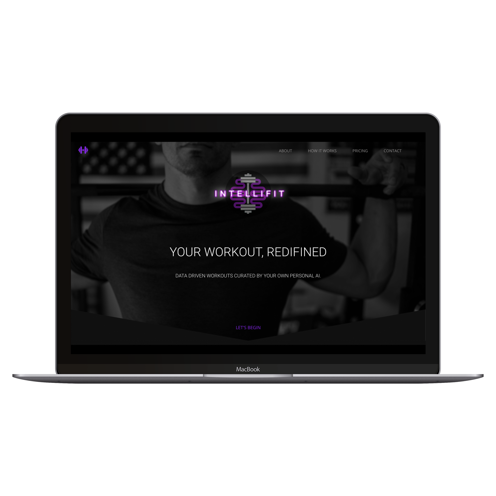

# fitness_app_scc

**Technologies used**
* HTML5
* CSS3
* Thimble CSS 
* JavaScript
* jQuery 
* Photoshop
* Font Awesome

**Approach taken**
* Conducted UX research in the form of quantitive and qualitative findings
* Posted a survey online and aggregated 100 results 
* Conducted 4 in person interviews to gain qualitative results
* Started wire framing our prototype in Adobe XD
* Wire framed landing page content 
* Built using technologies listed above
* Finalized landing page by adding SEO meta tags, reducing image size, validated HTML, and linted CSS

**Unsolved problems** 
* Bugs associated with both the testimonial slider and navbar color change

